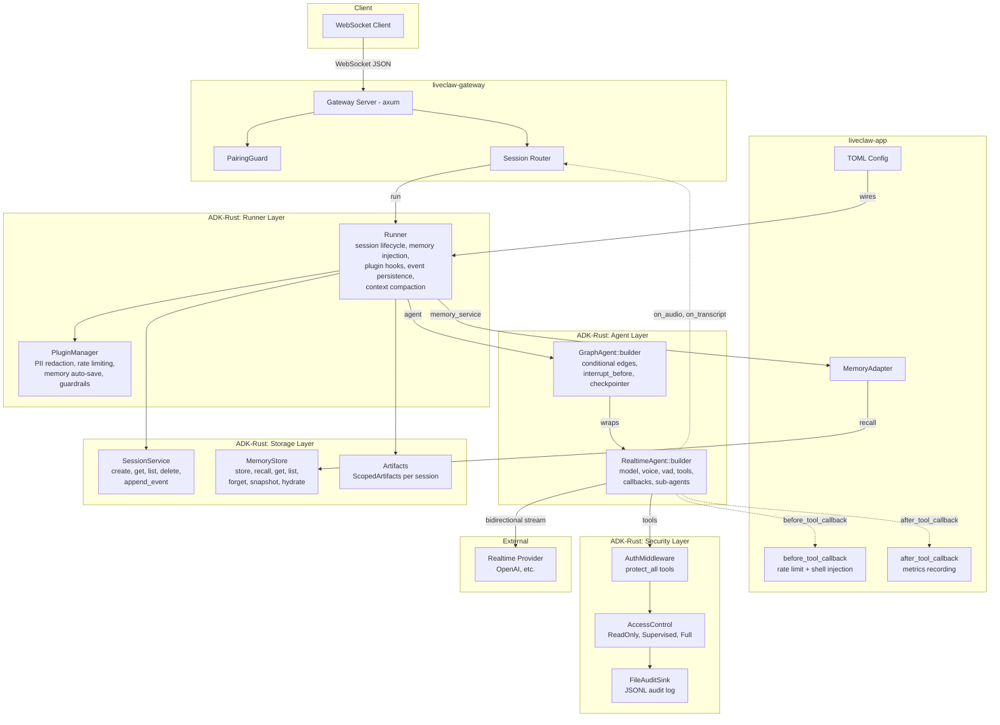
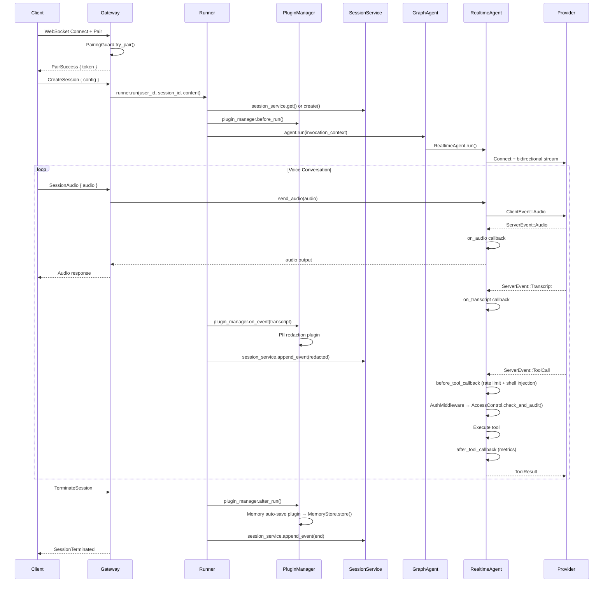
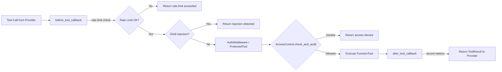
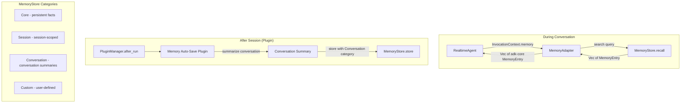

# Design Document: LiveClaw ADK Voice Runtime

## Overview

LiveClaw is a voice-first, real-time agent runtime built in Rust that maximizes ADK-Rust crate adoption. This revised design eliminates the custom `liveclaw-voice-node` crate entirely, replacing it with `adk-realtime::RealtimeAgent` for voice orchestration, `adk-runner::Runner` for session lifecycle management, `adk-memory::MemoryStore` for persistent memory, `adk-graph::GraphAgent` for multi-step orchestration, and `adk-plugin::PluginManager` for cross-cutting concerns. The architecture is reduced from 3 crates to 2.

### ADK-Rust Crate Dependencies

| ADK Crate | Version | Purpose |
|---|---|---|
| `adk-core` | 0.3.2 | Agent, Tool, Event, Session, Memory, Artifacts traits |
| `adk-realtime` | 0.3.2 | RealtimeAgent with builder, VadConfig, audio/transcript/speech callbacks |
| `adk-session` | 0.3.2 | SessionService (event-sourced), InMemorySessionService |
| `adk-tool` | 0.3.2 | FunctionTool, BasicToolset |
| `adk-runner` | 0.3.2 | Runner, RunnerConfig, EventsCompactionConfig |
| `adk-auth` | 0.3.2 | AccessControl, AuthMiddleware, FileAuditSink, Role, Permission |
| `adk-memory` | 0.3.2 | MemoryStore with categorized storage (Core, Session, Conversation) |
| `adk-graph` | 0.3.2 | GraphAgent with conditional edges, interrupts, checkpointing |
| `adk-plugin` | 0.3.2 | PluginManager, Plugin, PluginConfig with lifecycle hooks |
| `adk-telemetry` | 0.3.2 | Structured logging, tracing, OpenTelemetry metrics |

### LiveClaw Crate Structure (2 crates)

| Crate | Purpose |
|---|---|
| `liveclaw-gateway` | WebSocket server, pairing auth, session routing, gateway protocol |
| `liveclaw-app` | Entry point, TOML config, RealtimeAgent/Runner/GraphAgent wiring, MemoryAdapter, plugins, security callbacks, telemetry init |

### What LiveClaw Builds Custom (not in ADK-Rust)

1. **PairingGuard** — one-time 6-digit code pairing authentication
2. **Gateway WebSocket protocol** — `GatewayMessage`/`GatewayResponse`, session routing to Runner
3. **Shell injection before_tool_callback** — detects shell injection patterns in tool arguments
4. **Rate limiting before_tool_callback** — per-session tool execution rate limiting
5. **MemoryAdapter** — bridges `adk-memory::MemoryStore` to `adk-core::Memory` search interface
6. **Plugins** — PII redaction, rate limiting, memory auto-save, guardrail content filtering
7. **TOML config and app wiring**

### What LiveClaw Does NOT Build (provided by ADK-Rust)

1. ~~Custom VoiceNode~~ → `RealtimeAgent` handles bidirectional streaming, tool dispatch, audio/transcript callbacks
2. ~~Custom EventHandler~~ → `RealtimeAgent::builder()` callbacks (`on_audio`, `on_transcript`, `on_speech_started`, etc.)
3. ~~Custom session management~~ → `Runner` handles session get/create, event persistence
4. ~~Custom barge-in state machine~~ → `RealtimeAgent` with `server_vad()` and `VadConfig { interrupt_response: true }`
5. ~~Custom tool dispatch~~ → `RealtimeAgent` handles tool dispatch with `before_tool_callback`/`after_tool_callback`
6. ~~Custom memory~~ → `MemoryStore` + `MemoryAdapter` + `Runner` memory injection

## Architecture



### Data Flow: Voice Session Lifecycle (Runner-Managed)



### Data Flow: Tool Execution Pipeline



### Data Flow: Memory System



## Components and Interfaces

### liveclaw-gateway

#### Gateway Protocol Messages

```rust
#[derive(Debug, Clone, Serialize, Deserialize, PartialEq)]
#[serde(tag = "type")]
pub enum GatewayMessage {
    Pair { code: String },
    CreateSession { config: Option<SessionConfig> },
    TerminateSession { session_id: String },
    SessionAudio { session_id: String, audio: String },
    Ping,
}

#[derive(Debug, Clone, Serialize, Deserialize, PartialEq)]
#[serde(tag = "type")]
pub enum GatewayResponse {
    PairSuccess { token: String },
    PairFailure { reason: String },
    SessionCreated { session_id: String },
    SessionTerminated { session_id: String },
    AudioOutput { session_id: String, audio: String },
    TranscriptUpdate { session_id: String, text: String, is_final: bool },
    Error { code: String, message: String },
    Pong,
}

#[derive(Debug, Clone, Serialize, Deserialize, PartialEq)]
pub struct SessionConfig {
    pub model: Option<String>,
    pub voice: Option<String>,
    pub instructions: Option<String>,
    pub role: Option<String>,  // "readonly", "supervised", "full"
    pub enable_graph: Option<bool>,  // enable GraphAgent wrapping
}
```

#### Gateway Server

```rust
pub struct Gateway {
    config: GatewayConfig,
    pairing: Arc<PairingGuard>,
    runner: Arc<Runner>,
    /// Active session audio senders, keyed by session_id
    audio_senders: Arc<RwLock<HashMap<String, mpsc::Sender<Vec<u8>>>>>,
}

impl Gateway {
    pub async fn start(config: GatewayConfig, pairing: Arc<PairingGuard>, runner: Arc<Runner>) -> Result<()>;
    async fn handle_ws(ws: WebSocket, state: AppState);
    async fn handle_message(msg: GatewayMessage, state: &AppState) -> GatewayResponse;
}
```

#### PairingGuard (unchanged from previous design)

```rust
pub struct PairingGuard {
    require_pairing: bool,
    pairing_code: Option<String>,
    token_hashes: RwLock<Vec<String>>,
    failed_attempts: AtomicU32,
    max_attempts: u32,
    lockout_duration: Duration,
    lockout_until: RwLock<Option<Instant>>,
}

impl PairingGuard {
    pub fn new(require_pairing: bool, existing_tokens: &[String]) -> Self;
    pub fn pairing_code(&self) -> Option<String>;
    pub fn try_pair(&self, code: &str) -> Result<Option<String>, u64>;
    pub fn is_authenticated(&self, token: &str) -> bool;
}
```

### liveclaw-app

#### RealtimeAgent Construction

```rust
use adk_realtime::{RealtimeAgent, VadConfig};
use adk_auth::{AccessControl, AuthMiddleware, FileAuditSink, Role, Permission};
use adk_tool::FunctionTool;

/// Build the RealtimeAgent with all callbacks and tools.
pub fn build_realtime_agent(
    config: &VoiceConfig,
    tools: Vec<Arc<dyn adk_core::Tool>>,
    access_control: Arc<AccessControl>,
    rate_limiter: Arc<RateLimiter>,
    audio_tx: mpsc::Sender<AudioOutput>,
    transcript_tx: mpsc::Sender<TranscriptOutput>,
) -> Result<RealtimeAgent> {
    // Wrap tools with AuthMiddleware for role-based access control
    let middleware = AuthMiddleware::new(access_control.clone());
    let protected_tools = middleware.protect_all(tools);

    let mut builder = RealtimeAgent::builder("voice_assistant")
        .model(Arc::new(config.model_provider()?))
        .instruction(&config.instructions.clone().unwrap_or_default())
        .voice(&config.voice.clone().unwrap_or("alloy".into()))
        .server_vad()  // VadConfig with interrupt_response: true
        // Register before_tool_callback for rate limiting + shell injection
        .before_tool_callback(Box::new(move |ctx, tool_name, args| {
            let rl = rate_limiter.clone();
            Box::pin(async move {
                // Rate limit check
                let session_id = ctx.session_id();
                if !rl.check_and_increment(session_id) {
                    return Err(anyhow::anyhow!("Rate limit exceeded for session {}", session_id));
                }
                // Shell injection check
                if contains_shell_injection(args) {
                    return Err(anyhow::anyhow!("Shell injection detected in tool arguments"));
                }
                Ok(())
            })
        }))
        // Register after_tool_callback for metrics
        .after_tool_callback(Box::new(move |ctx, tool_name, duration, result| {
            Box::pin(async move {
                tracing::info!(
                    tool = %tool_name,
                    duration_ms = duration.as_millis(),
                    success = result.is_ok(),
                    "Tool execution completed"
                );
                Ok(())
            })
        }))
        // Audio output callback — sends to Gateway for client playback
        .on_audio(Box::new(move |audio_data| {
            let tx = audio_tx.clone();
            Box::pin(async move {
                let _ = tx.send(AudioOutput { data: audio_data.to_vec() }).await;
            })
        }))
        // Transcript callback — triggers PII redaction via plugin pipeline
        .on_transcript(Box::new(move |text, is_final| {
            let tx = transcript_tx.clone();
            Box::pin(async move {
                let _ = tx.send(TranscriptOutput {
                    text: text.to_string(),
                    is_final,
                }).await;
            })
        }))
        // Speech started callback — latency tracking
        .on_speech_started(Box::new(move || {
            Box::pin(async move {
                tracing::debug!("Speech started — recording timestamp for latency");
            })
        }))
        // Speech stopped callback
        .on_speech_stopped(Box::new(move || {
            Box::pin(async move {
                tracing::debug!("Speech stopped");
            })
        }));

    // Register all protected tools
    for tool in protected_tools {
        builder = builder.tool(tool);
    }

    builder.build()
}

/// Output types for callback channels
pub struct AudioOutput {
    pub data: Vec<u8>,
}

pub struct TranscriptOutput {
    pub text: String,
    pub is_final: bool,
}
```

#### Shell Injection Detection (before_tool_callback)

```rust
/// Shell injection patterns to detect in tool arguments.
const SHELL_PATTERNS: &[&str] = &[
    ";", "`", "$(", "|", "&&", "||", ">", "<", "\n",
];

/// Check if a string contains shell injection patterns.
pub fn contains_shell_injection(input: &str) -> bool {
    SHELL_PATTERNS.iter().any(|pattern| input.contains(pattern))
}
```

#### Rate Limiter (before_tool_callback)

```rust
/// Per-session rate limiter for tool executions.
pub struct RateLimiter {
    limit: u32,
    counts: RwLock<HashMap<String, AtomicU32>>,
}

impl RateLimiter {
    pub fn new(limit: u32) -> Self;
    pub fn check_and_increment(&self, session_id: &str) -> bool;
    pub fn reset(&self, session_id: &str);
}
```

#### Role Configuration (using adk-auth)

```rust
use adk_auth::{Role, Permission, AccessControl, AuthMiddleware, FileAuditSink};

pub fn build_access_control(config: &SecurityConfig) -> AccessControl {
    let readonly = Role::new("readonly");

    let mut supervised = Role::new("supervised");
    for tool_name in &config.tool_allowlist {
        supervised = supervised.allow(Permission::Tool(tool_name.clone()));
    }

    let full = Role::new("full").allow(Permission::AllTools);
    let sink = FileAuditSink::new(&config.audit_log_path);

    AccessControl::builder()
        .role(readonly)
        .role(supervised)
        .role(full)
        .audit_sink(sink)
        .build()
        .expect("Failed to build AccessControl")
}
```

#### MemoryAdapter (bridges adk-memory to adk-core)

```rust
use adk_core::Memory;
use adk_memory::MemoryStore;

/// Bridges adk-memory::MemoryStore (full CRUD) to adk-core::Memory (search-only).
/// The Runner injects this into InvocationContext.memory_service so the agent
/// can search past memories during conversation.
pub struct MemoryAdapter {
    store: Arc<dyn MemoryStore>,
    recall_limit: usize,
}

impl MemoryAdapter {
    pub fn new(store: Arc<dyn MemoryStore>, recall_limit: usize) -> Self {
        Self { store, recall_limit }
    }
}

#[async_trait]
impl Memory for MemoryAdapter {
    async fn search(&self, query: &str) -> Result<Vec<adk_core::MemoryEntry>> {
        let entries = self.store.recall(query, self.recall_limit).await?;
        Ok(entries.into_iter().map(|e| adk_core::MemoryEntry {
            content: e.content,
            author: e.author,
        }).collect())
    }
}
```

#### GraphAgent Construction (optional orchestration layer)

```rust
use adk_graph::{GraphAgent, AgentNode, START, MemoryCheckpointer};

/// Optionally wrap RealtimeAgent in a GraphAgent for multi-step orchestration.
/// When the session role is "supervised", interrupt_before is set on the tools node
/// for human-in-the-loop approval.
pub fn build_graph_agent(
    realtime_agent: RealtimeAgent,
    config: &GraphConfig,
    role: &str,
) -> Result<GraphAgent> {
    let agent_node = AgentNode::new("agent", Arc::new(realtime_agent));

    let mut builder = GraphAgent::builder("voice_orchestrator")
        .node(agent_node)
        .node_fn("tools", execute_tools)
        .edge(START, "agent")
        .conditional_edge("agent", route_after_agent, vec!["tools", "end"])
        .edge("tools", "agent")  // Cycle back for ReAct pattern
        .checkpointer(MemoryCheckpointer::new())
        .recursion_limit(config.recursion_limit.unwrap_or(25));

    // Human-in-the-loop for supervised role
    if role == "supervised" {
        builder = builder.interrupt_before(&["tools"]);
    }

    builder.build()
}

/// Router function: if agent produced tool calls, route to "tools"; otherwise "end".
fn route_after_agent(state: &GraphState) -> &str {
    if state.has_pending_tool_calls() {
        "tools"
    } else {
        "end"
    }
}

/// Tool execution node function.
async fn execute_tools(state: &mut GraphState) -> Result<()> {
    // Execute pending tool calls via the tool pipeline
    // Tools are already wrapped with AuthMiddleware
    for tool_call in state.pending_tool_calls() {
        let result = state.execute_tool(tool_call).await?;
        state.add_tool_result(result);
    }
    Ok(())
}
```

#### Plugin Implementations

```rust
use adk_plugin::{Plugin, PluginConfig, PluginManager};
use adk_memory::{MemoryStore, MemoryEntry, Category};

/// Build the PluginManager with all LiveClaw plugins.
pub fn build_plugin_manager(
    memory_store: Arc<dyn MemoryStore>,
    pii_patterns: Vec<regex::Regex>,
    blocked_keywords: Vec<String>,
) -> PluginManager {
    let plugins = vec![
        build_pii_redaction_plugin(pii_patterns),
        build_memory_autosave_plugin(memory_store),
        build_guardrail_plugin(blocked_keywords),
    ];
    PluginManager::new(plugins)
}

/// PII Redaction Plugin — intercepts transcript events via on_event hook,
/// redacts PII before the event is persisted to the session.
fn build_pii_redaction_plugin(patterns: Vec<regex::Regex>) -> Plugin {
    Plugin::new(PluginConfig {
        name: "pii_redactor".to_string(),
        on_event: Some(Box::new(move |ctx, event| {
            let patterns = patterns.clone();
            Box::pin(async move {
                if let Some(transcript) = event.as_transcript() {
                    let mut redacted = transcript.text.clone();
                    for pattern in &patterns {
                        redacted = pattern.replace_all(&redacted, "[REDACTED]").to_string();
                    }
                    // Return modified event with redacted text
                    Ok(Some(event.with_text(redacted)))
                } else {
                    Ok(None) // Pass through non-transcript events
                }
            })
        })),
        ..Default::default()
    })
}

/// Memory Auto-Save Plugin — stores conversation summary after session ends
/// via after_run hook using Conversation category.
fn build_memory_autosave_plugin(store: Arc<dyn MemoryStore>) -> Plugin {
    Plugin::new(PluginConfig {
        name: "memory_autosave".to_string(),
        after_run: Some(Box::new(move |ctx| {
            let store = store.clone();
            Box::pin(async move {
                // Summarize conversation from context
                let summary = ctx.conversation_summary();
                if !summary.is_empty() {
                    let entry = MemoryEntry {
                        content: summary.into(),
                        category: Category::Conversation,
                        ..Default::default()
                    };
                    store.store(entry).await.ok();
                }
                Ok(())
            })
        })),
        ..Default::default()
    })
}

/// Guardrail Plugin — validates user messages for harmful content
/// via on_user_message hook.
fn build_guardrail_plugin(blocked_keywords: Vec<String>) -> Plugin {
    Plugin::new(PluginConfig {
        name: "guardrail".to_string(),
        on_user_message: Some(Box::new(move |ctx, message| {
            let keywords = blocked_keywords.clone();
            Box::pin(async move {
                let text = message.as_text().unwrap_or_default();
                for keyword in &keywords {
                    if text.to_lowercase().contains(&keyword.to_lowercase()) {
                        return Err(anyhow::anyhow!("Blocked content detected: {}", keyword));
                    }
                }
                Ok(())
            })
        })),
        ..Default::default()
    })
}
```

#### Runner Construction

```rust
use adk_runner::{Runner, RunnerConfig, EventsCompactionConfig};
use adk_session::InMemorySessionService;

/// Build the Runner that manages the full session lifecycle.
pub fn build_runner(
    agent: Arc<dyn adk_core::Agent>,  // RealtimeAgent or GraphAgent
    session_service: Arc<dyn adk_session::SessionService>,
    memory_adapter: Option<Arc<MemoryAdapter>>,
    artifact_service: Option<Arc<dyn adk_core::Artifacts>>,
    plugin_manager: Option<Arc<PluginManager>>,
    compaction_config: Option<EventsCompactionConfig>,
) -> Result<Runner> {
    Runner::new(RunnerConfig {
        app_name: "liveclaw".to_string(),
        agent,
        session_service,
        artifact_service,
        memory_service: memory_adapter.map(|m| m as Arc<dyn adk_core::Memory>),
        plugin_manager,
        run_config: None,
        compaction_config,
    })
}
```

#### Application Entry Point

```rust
use adk_telemetry::{init_telemetry, init_with_otlp};

pub struct App;

impl App {
    pub async fn run(config_path: &str) -> Result<()> {
        let config = LiveClawConfig::load(config_path)?;

        // 1. Initialize telemetry
        if config.telemetry.otlp_enabled {
            init_with_otlp("liveclaw");
        } else {
            init_telemetry("liveclaw");
        }

        // 2. Build adk-auth AccessControl
        let ac = Arc::new(build_access_control(&config.security));

        // 3. Build rate limiter
        let rate_limiter = Arc::new(RateLimiter::new(config.security.rate_limit_per_session));

        // 4. Build audio/transcript channels for Gateway ↔ RealtimeAgent
        let (audio_tx, audio_rx) = mpsc::channel(256);
        let (transcript_tx, transcript_rx) = mpsc::channel(256);

        // 5. Build tools and RealtimeAgent
        let tools = load_tools(&config)?;
        let realtime_agent = build_realtime_agent(
            &config.voice, tools, ac.clone(), rate_limiter.clone(),
            audio_tx, transcript_tx,
        )?;

        // 6. Optionally wrap in GraphAgent
        let agent: Arc<dyn adk_core::Agent> = if config.graph.enable_graph {
            Arc::new(build_graph_agent(
                realtime_agent,
                &config.graph,
                &config.security.default_role,
            )?)
        } else {
            Arc::new(realtime_agent)
        };

        // 7. Build SessionService
        let session_service: Arc<dyn adk_session::SessionService> =
            Arc::new(InMemorySessionService::new());

        // 8. Build MemoryStore and MemoryAdapter
        let memory_store: Arc<dyn MemoryStore> = Arc::new(
            adk_memory::InMemoryMemoryStore::new()
        );
        let memory_adapter = Arc::new(MemoryAdapter::new(
            memory_store.clone(),
            config.memory.recall_limit.unwrap_or(10),
        ));

        // 9. Build artifact service (optional)
        let artifact_service = if config.artifact.enable_artifacts {
            Some(Arc::new(adk_core::FileArtifacts::new(&config.artifact.storage_path)?))
        } else {
            None
        };

        // 10. Build PluginManager
        let pii_patterns = build_pii_patterns();
        let plugin_manager = Arc::new(build_plugin_manager(
            memory_store.clone(),
            pii_patterns,
            config.plugin.custom_blocked_keywords.clone(),
        ));

        // 11. Build compaction config (optional)
        let compaction_config = if config.compaction.enable_compaction {
            Some(EventsCompactionConfig {
                max_events: config.compaction.max_events_threshold.unwrap_or(500),
                ..Default::default()
            })
        } else {
            None
        };

        // 12. Build Runner
        let runner = Arc::new(build_runner(
            agent,
            session_service,
            Some(memory_adapter),
            artifact_service,
            Some(plugin_manager),
            compaction_config,
        )?);

        // 13. Build PairingGuard and Gateway
        let pairing = Arc::new(PairingGuard::new(config.gateway.require_pairing, &[]));
        let gateway = Gateway::new(config.gateway.clone(), pairing, runner);

        // 14. Start Gateway (includes /health endpoint)
        gateway.start().await
    }
}

/// PII regex patterns for the PII redaction plugin.
fn build_pii_patterns() -> Vec<regex::Regex> {
    vec![
        regex::Regex::new(r"\b[A-Za-z0-9._%+-]+@[A-Za-z0-9.-]+\.[A-Z|a-z]{2,}\b").unwrap(),  // email
        regex::Regex::new(r"\b\d{3}[-.]?\d{3}[-.]?\d{4}\b").unwrap(),  // phone
        regex::Regex::new(r"\b\d{3}-\d{2}-\d{4}\b").unwrap(),  // SSN
        regex::Regex::new(r"\b\d{4}[-\s]?\d{4}[-\s]?\d{4}[-\s]?\d{4}\b").unwrap(),  // credit card
        regex::Regex::new(r"\b\d{1,3}\.\d{1,3}\.\d{1,3}\.\d{1,3}\b").unwrap(),  // IP
    ]
}
```

## Data Models

### Configuration

```rust
#[derive(Debug, Clone, Serialize, Deserialize, PartialEq)]
pub struct LiveClawConfig {
    #[serde(default)]
    pub gateway: GatewayConfig,
    #[serde(default)]
    pub voice: VoiceConfig,
    #[serde(default)]
    pub security: SecurityConfig,
    #[serde(default)]
    pub plugin: PluginConfig,
    #[serde(default)]
    pub memory: MemoryConfig,
    #[serde(default)]
    pub graph: GraphConfig,
    #[serde(default)]
    pub compaction: CompactionConfig,
    #[serde(default)]
    pub artifact: ArtifactConfig,
    #[serde(default)]
    pub pairing: PairingConfig,
    #[serde(default)]
    pub telemetry: TelemetryConfig,
}

#[derive(Debug, Clone, Serialize, Deserialize, PartialEq)]
pub struct GatewayConfig {
    #[serde(default = "default_host")]
    pub host: String,           // default: "127.0.0.1"
    #[serde(default = "default_port")]
    pub port: u16,              // default: 8420
    #[serde(default = "default_true")]
    pub require_pairing: bool,  // default: true
}

#[derive(Debug, Clone, Serialize, Deserialize, PartialEq)]
pub struct VoiceConfig {
    pub provider: String,
    pub api_key: String,
    #[serde(default = "default_model")]
    pub model: String,
    pub voice: Option<String>,
    pub instructions: Option<String>,
    #[serde(default)]
    pub audio_format: AudioFormat,
}

#[derive(Debug, Clone, Serialize, Deserialize, PartialEq, Default)]
pub enum AudioFormat {
    #[default]
    Pcm16_24kHz,
    Pcm16_16kHz,
}

#[derive(Debug, Clone, Serialize, Deserialize, PartialEq)]
pub struct SecurityConfig {
    #[serde(default = "default_role")]
    pub default_role: String,               // default: "supervised"
    #[serde(default)]
    pub tool_allowlist: Vec<String>,
    #[serde(default = "default_rate_limit")]
    pub rate_limit_per_session: u32,        // default: 100
    #[serde(default = "default_audit_path")]
    pub audit_log_path: String,             // default: "audit.jsonl"
}

#[derive(Debug, Clone, Serialize, Deserialize, PartialEq)]
pub struct PluginConfig {
    #[serde(default = "default_true")]
    pub enable_pii_redaction: bool,         // default: true
    #[serde(default = "default_true")]
    pub enable_memory_autosave: bool,       // default: true
    #[serde(default)]
    pub custom_blocked_keywords: Vec<String>,
}

#[derive(Debug, Clone, Serialize, Deserialize, PartialEq)]
pub struct MemoryConfig {
    #[serde(default = "default_memory_backend")]
    pub backend: String,                    // default: "in_memory"
    #[serde(default)]
    pub recall_limit: Option<usize>,        // default: 10
}

#[derive(Debug, Clone, Serialize, Deserialize, PartialEq)]
pub struct GraphConfig {
    #[serde(default)]
    pub enable_graph: bool,                 // default: false
    #[serde(default)]
    pub recursion_limit: Option<usize>,     // default: 25
}

#[derive(Debug, Clone, Serialize, Deserialize, PartialEq)]
pub struct CompactionConfig {
    #[serde(default)]
    pub enable_compaction: bool,            // default: false
    #[serde(default)]
    pub max_events_threshold: Option<usize>, // default: 500
}

#[derive(Debug, Clone, Serialize, Deserialize, PartialEq)]
pub struct ArtifactConfig {
    #[serde(default)]
    pub enable_artifacts: bool,             // default: false
    #[serde(default = "default_artifact_path")]
    pub storage_path: String,               // default: "./artifacts"
}

#[derive(Debug, Clone, Serialize, Deserialize, PartialEq)]
pub struct PairingConfig {
    #[serde(default = "default_max_attempts")]
    pub max_attempts: u32,                  // default: 5
    #[serde(default = "default_lockout_secs")]
    pub lockout_duration_secs: u64,         // default: 300
}

#[derive(Debug, Clone, Serialize, Deserialize, PartialEq)]
pub struct TelemetryConfig {
    #[serde(default)]
    pub otlp_enabled: bool,                 // default: false
}
```

### Gateway Protocol

```rust
pub type SessionId = String;

#[derive(Debug, Clone, Serialize, Deserialize, PartialEq)]
#[serde(tag = "type")]
pub enum GatewayMessage {
    Pair { code: String },
    CreateSession { config: Option<SessionConfig> },
    TerminateSession { session_id: SessionId },
    SessionAudio { session_id: SessionId, audio: String },
    Ping,
}

#[derive(Debug, Clone, Serialize, Deserialize, PartialEq)]
#[serde(tag = "type")]
pub enum GatewayResponse {
    PairSuccess { token: String },
    PairFailure { reason: String },
    SessionCreated { session_id: SessionId },
    SessionTerminated { session_id: SessionId },
    AudioOutput { session_id: SessionId, audio: String },
    TranscriptUpdate { session_id: SessionId, text: String, is_final: bool },
    Error { code: String, message: String },
    Pong,
}
```

### Session Event Types (stored via SessionService::append_event)

```rust
/// Events appended to the session via SessionService::append_event().
/// These use adk-session's Event type with custom metadata.
pub enum LiveClawEventKind {
    /// User audio transcribed (after PII redaction)
    UserTranscript { text: String, timestamp: Instant },
    /// Agent audio transcribed
    AgentTranscript { text: String, timestamp: Instant },
    /// Tool execution recorded
    ToolExecution { tool_name: String, duration_ms: u64, success: bool },
    /// Session state change
    StateChange { from: String, to: String },
    /// Barge-in occurred
    BargeIn { timestamp: Instant },
}
```

## Correctness Properties

*A property is a characteristic or behavior that should hold true across all valid executions of a system — essentially, a formal statement about what the system should do. Properties serve as the bridge between human-readable specifications and machine-verifiable correctness guarantees.*

### Serialization Round-Trip Properties

**Property 1: GatewayMessage JSON round-trip**
*For any* valid `GatewayMessage` value, serializing to JSON then deserializing should produce a value equal to the original.
**Validates: Requirements 1.8**

**Property 2: GatewayResponse JSON round-trip**
*For any* valid `GatewayResponse` value, serializing to JSON then deserializing should produce a value equal to the original.
**Validates: Requirements 1.9**

**Property 19: Configuration TOML round-trip**
*For any* valid `LiveClawConfig` value, serializing to TOML then deserializing should produce a value equal to the original.
**Validates: Requirements 16.6**

### Gateway Authentication Properties

**Property 3: Unauthenticated session commands rejected**
*For any* session command (`CreateSession`, `TerminateSession`, or `SessionAudio`) sent without a valid authentication token, the Gateway should respond with an authentication error and never create, terminate, or forward to a session.
**Validates: Requirements 1.3, 1.10**

### Pairing Authentication Properties

**Property 4: PairingGuard generates 6-digit code**
*For any* PairingGuard constructed with `require_pairing: true` and an empty token list, the generated pairing code should be exactly 6 decimal digits (matching `^\d{6}$`).
**Validates: Requirements 2.1**

**Property 5: Pair-then-authenticate round-trip**
*For any* PairingGuard, submitting the correct pairing code should return a token, and subsequently authenticating with that token should succeed.
**Validates: Requirements 2.2**

**Property 6: Incorrect pairing code rejected**
*For any* PairingGuard and any code string that does not match the generated pairing code, the pairing attempt should be rejected.
**Validates: Requirements 2.3**

**Property 7: Lockout after max failed attempts**
*For any* PairingGuard with `max_attempts = N`, after N consecutive incorrect pairing attempts, further attempts should be locked out (returning a lockout duration > 0).
**Validates: Requirements 2.4**

**Property 8: Pairing disabled allows all**
*For any* PairingGuard constructed with `require_pairing: false`, `is_authenticated()` should return true for any token string.
**Validates: Requirements 2.6**

### Role-Based Access Control Properties (adk-auth)

**Property 9: Role-based tool access control**
*For any* AccessControl configured with ReadOnly, Supervised, and Full roles, and any tool name: a session assigned `ReadOnly` should be denied all tools; a session assigned `Supervised` should be allowed only tools in the allowlist and denied all others; a session assigned `Full` should be allowed all tools.
**Validates: Requirements 3.1, 3.3**

**Property 10: Rate limit blocks after N executions**
*For any* rate limit value N > 0, after recording exactly N tool executions for a session via `check_and_increment()`, the next call should return false (blocked).
**Validates: Requirements 3.7**

### Security Callback Properties

**Property 11: Shell injection patterns blocked**
*For any* string containing at least one shell injection pattern (`;`, `` ` ``, `$(`, `|`, `&&`, `||`, `>`, `<`, or `\n`), the `contains_shell_injection()` function should return true.
**Validates: Requirements 4.1**

**Property 12: PII redaction removes PII from text**
*For any* text string containing an email address, phone number, SSN, credit card number, or IP address, after running the PII redaction patterns, the redacted text should not contain the original PII values and should contain `[REDACTED]` markers instead.
**Validates: Requirements 4.3**

**Property 13: Guardrail blocks harmful content keywords**
*For any* message text containing a blocked keyword (case-insensitive), the guardrail plugin should reject the message with an error.
**Validates: Requirements 4.5**

### Audit Properties (adk-auth)

**Property 14: Audit events contain required fields**
*For any* tool access check via `check_and_audit()`, the resulting `AuditEvent` should contain the tool name, session identifier, outcome (Allowed or Denied), and a valid timestamp.
**Validates: Requirements 5.3**

### Session and Memory Properties

**Property 15: Transcript stored via append_event round-trip**
*For any* transcript text, after appending it as an event via `SessionService::append_event()`, the session's `events()` should contain an event with the transcript text.
**Validates: Requirements 10.2**

**Property 16: MemoryAdapter delegates search to MemoryStore**
*For any* search query, the `MemoryAdapter::search()` should return results equivalent to calling `MemoryStore::recall()` with the same query and the configured recall limit, with entries converted to `adk-core::MemoryEntry` format.
**Validates: Requirements 11.1**

**Property 17: Memory store-then-recall round-trip**
*For any* valid `MemoryEntry`, storing it via `MemoryStore::store()` then recalling via `MemoryStore::recall()` with a query matching the entry's content should return results containing the stored entry.
**Validates: Requirements 11.5**

### Voice Session Properties

**Property 18: Session remains active after barge-in**
*For any* active voice session, after a barge-in event (simulated via server-side VAD), the session should remain in an active state and the Runner should continue accepting events for that session.
**Validates: Requirements 7.4**

### Configuration Properties

**Property 20: Missing config values use defaults**
*For any* partial TOML config string that omits optional fields, parsing should succeed and the resulting config should have the documented default values for all omitted fields.
**Validates: Requirements 16.3**

**Property 21: Invalid TOML returns parse error**
*For any* string that is not valid TOML, parsing as `LiveClawConfig` should return an error.
**Validates: Requirements 16.4**

**Property 22: Unknown config fields ignored**
*For any* valid TOML config string with additional unknown key-value pairs appended, parsing should succeed and produce the same config as parsing without the unknown fields.
**Validates: Requirements 16.5**

## Error Handling

### Gateway Errors
- Invalid WebSocket message: respond with `GatewayResponse::Error { code: "invalid_message", message }` and keep connection open
- Authentication failure: respond with `GatewayResponse::Error { code: "auth_required", message }` and close connection after 3 consecutive failures
- Session not found: respond with `GatewayResponse::Error { code: "session_not_found", message }`

### Pairing Errors
- Brute-force lockout: after `max_attempts` failures, lock for `lockout_duration` seconds, return remaining lockout time in the error
- Constant-time comparison: use `constant_time_eq` for token hash comparison to prevent timing attacks

### Access Control Errors (adk-auth)
- Tool denied by role: `AccessControl::check()` returns `Err(AccessDenied)` with reason; `before_tool_callback` propagates the error to the RealtimeAgent which sends denial response to provider
- Rate limit exceeded: `before_tool_callback` returns error; RealtimeAgent sends "rate limit exceeded" response to provider

### Security Callback Errors
- Shell injection detected: `before_tool_callback` returns error with detected pattern; tool execution blocked
- Harmful content detected by guardrail plugin: `on_user_message` hook returns error; message rejected

### Plugin Errors
- PII redaction failure: log warning via `tracing::warn!`, pass through original event (fail-open for availability)
- Memory auto-save failure: log warning, do not block session termination
- Guardrail plugin failure: log error, reject message (fail-closed for safety)

### Runner Errors
- Session creation failure: Runner returns error; Gateway responds with `Error { code: "session_create_failed" }`
- Provider connection drop: RealtimeAgent handles reconnection with exponential backoff (initial 1s, max 30s, configurable max retries)
- Context compaction failure: log error, continue without compaction

### Configuration Errors
- Missing config file: use all defaults, log info message
- Invalid TOML: return descriptive error with line/column information
- Invalid field values: return validation error listing all invalid fields

## Testing Strategy

### Property-Based Testing

LiveClaw uses the `proptest` crate for property-based testing. Each correctness property maps to a single `proptest!` test.

**Configuration:**
- Minimum 100 test cases per property (`PROPTEST_CASES=100`)
- Each test tagged with a comment: `// Feature: liveclaw-adk-voice-runtime, Property N: {title}`
- Custom `Arbitrary` implementations for `GatewayMessage`, `GatewayResponse`, `LiveClawConfig`, `SessionConfig`

**Property test coverage:**
- Properties 1-2: Gateway protocol JSON round-trips
- Property 3: Gateway authentication enforcement
- Properties 4-8: PairingGuard behavior
- Properties 9-10: adk-auth role-based access control and rate limiting
- Properties 11-13: Shell injection, PII redaction, guardrail blocking
- Property 14: adk-auth audit event completeness
- Properties 15-17: Session append_event round-trip, MemoryAdapter delegation, memory store-recall round-trip
- Property 18: Voice session active after barge-in
- Properties 19-22: Configuration round-trip and edge cases

### Unit Testing

Unit tests complement property tests by covering:
- Specific examples of each gateway message variant serialization
- Edge cases: empty strings, unicode content, maximum-length fields
- Default configuration values for all config sections
- Specific injection patterns (semicolons, backticks, `$(...)`, pipes, `&&`, `||`, `>`, `<`)
- Pairing code format validation
- Role assignment and permission checks with specific tool names
- PII redaction with specific email/phone/SSN/credit card/IP patterns
- Health check endpoint response format
- MemoryAdapter with empty store returns empty results
- Plugin lifecycle hook ordering (before_run → on_event → after_run)
- GraphAgent interrupt_before configuration for supervised role

### Integration Testing

Integration tests (not part of property-based testing) cover:
- WebSocket connection lifecycle with the Gateway
- End-to-end tool dispatch through Runner → RealtimeAgent → before_tool_callback → AuthMiddleware → execute
- Session persistence via `adk-session::InMemorySessionService` with `append_event()`
- Memory store → MemoryAdapter → InvocationContext flow
- Plugin manager lifecycle: before_run, on_event, after_run hooks
- Audit log file output verification
- GraphAgent with interrupt_before for supervised role
- Context compaction trigger after threshold events

### Test Organization

```
liveclaw-gateway/
  src/
    protocol.rs        // GatewayMessage/Response + proptest round-trips
    pairing.rs         // PairingGuard + proptest
    server.rs          // Gateway server
  tests/
    ws_integration.rs  // WebSocket integration tests

liveclaw-app/
  src/
    config.rs          // LiveClawConfig + proptest TOML round-trip
    agent.rs           // RealtimeAgent construction + callbacks
    security.rs        // Shell injection, rate limiter, access control
    memory.rs          // MemoryAdapter + proptest
    plugins.rs         // Plugin implementations + proptest
    graph.rs           // GraphAgent construction
    runner.rs          // Runner construction
    main.rs            // Entry point
  tests/
    integration.rs     // End-to-end integration tests
```
